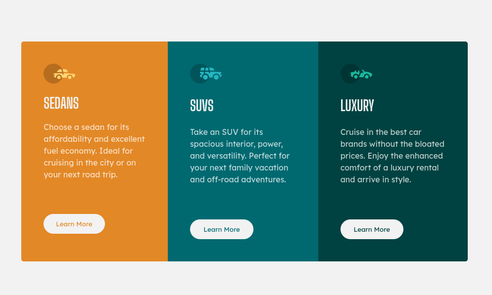

# Frontend Mentor - 3-column preview card component solution

This is a solution to the [3-column preview card component challenge on Frontend Mentor](https://www.frontendmentor.io/challenges/3column-preview-card-component-pH92eAR2-). Frontend Mentor challenges help you improve your coding skills by building realistic projects. 

## Table of contents

- [Overview](#overview)
  - [The challenge](#the-challenge)
  - [Screenshot](#screenshot)
  - [Links](#links)
- [My process](#my-process)
  - [Built with](#built-with)
  - [What I learned](#what-i-learned)
  - [Continued development](#continued-development)
  - [Useful resources](#useful-resources)
- [Author](#author)

## Overview

### The challenge

Users should be able to:

- See hover states for interactive elements

### Screenshot

### Links

- Solution URL: [github](https://github.com/chazm78/3-column-preview-card-component)
- Live Site URL: [vercel](https://3-column-preview-card-component-dusky.vercel.app/)

### Built with

- Semantic HTML5 markup
- CSS custom properties
- Flexbox

### What I learned
- Mobile first
- Continued with understanding Flexbox more
- Continued with understanding CSS custom properties
  

### Continued development
I have a long way to go but i am enjoying the adventure. Developing for mobile first and then expanding the site is very interesting and frustrating at times. Sometimes flexbox works my nerves but I know its because I am still wrapping my head around things.

### Useful resources

The Internet

## Author

- Frontend Mentor - [@chazm78](https://www.frontendmentor.io/profile/chazm78)
- Github - [@chazm78](https://github.com/chazm78)